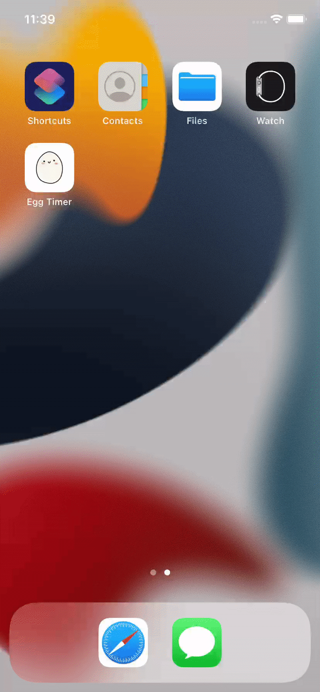

# EggTimer iOS App

This is a simple one-page iOS app written in Swift 5 and designed with Storyboard. The app is mainly developed to practice:
- Play audio file (AVAudioPlayer)
- Timer()
- Dictionary 
- UIProgressView

### Simulator: 
The app is designed to run on iPhone 11.
<h3 align="">

</h3>

### Refrence:
The idea of the Egg Timer App is from [@Appbrewery](https://github.com/appbrewery).
